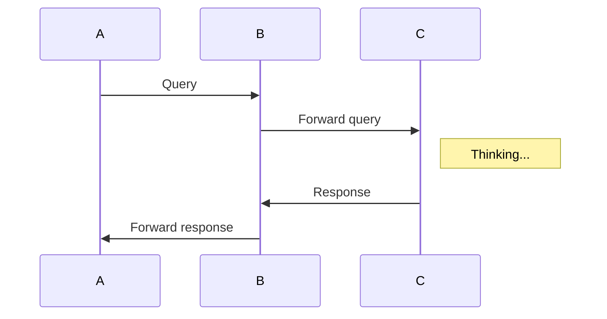
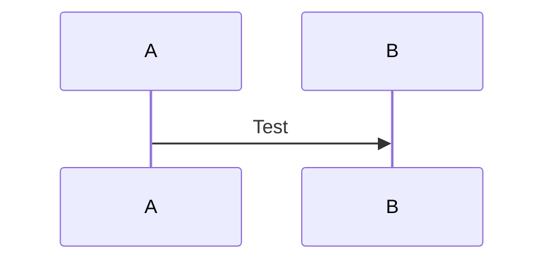
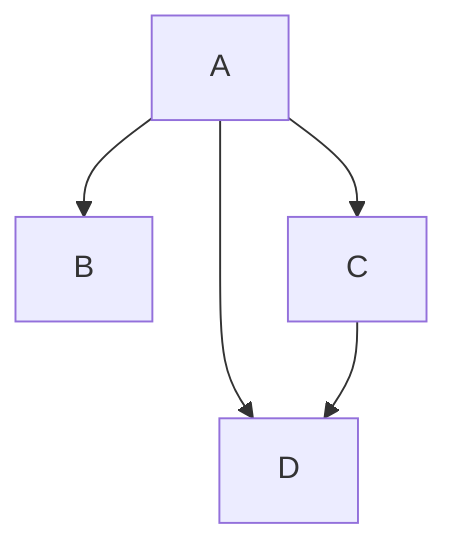

# hello-world
Hello World Test
This is my second change

## Test 

```mermaid
sequenceDiagram
  A->> B: Query
  B->> C: Forward query
  Note right of C: Thinking...
  C->> B: Response
  B->> A: Forward response
```

### Test2

```mermaid
sequenceDiagram
A->> B: Test
```

#### Test3

```mermaid
graph TD;
A-->B;
A-->C;
A-->D;
C-->D;

```

   

