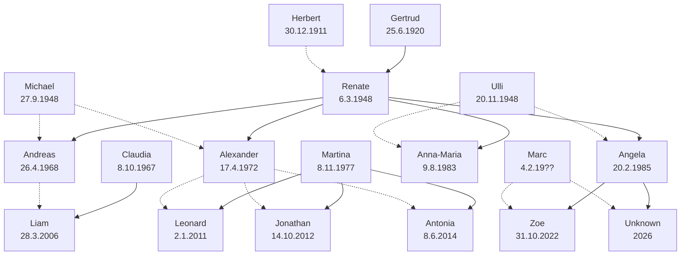

# Dorn Eysler Clan

## Halbgeschwister Mutter



## Alle

```mermaid
graph TD

    Andreas[Andreas <br>26.4.1968]
    Alexander[Alexander <br>17.4.1972]
    Claudia[Claudia <br>8.10.1967]
    Renate[Renate <br>6.3.1948]
    Ulli[Ulli <br>20.11.1948]
    Michael[Michael<br>27.9.1948]
    Herbert[Herbert<br>30.12.1911]
    Gertrud[Gertrud<br>25.6.1920]
    Liam[Liam<br>28.3.2006]
    Antonia[Antonia<br>8.6.2014]
    Leonard[Leonard<br>2.1.2011]
    Jonathan[Jonathan<br>14.10.2012]
    Zoe[Zoe<br>31.10.2022]
    Unknown[Unknown<br>2026]
    Angela[Angela<br>20.2.1985]
    Anna-Maria[Anna-Maria<br>9.8.1983]
    Martina[Martina<br>8.11.1977]
    Marc[Marc<br>4.2.19??]

    Gudrun[Gudrun<br>18.7.1958]
    Sebastian[Sebastian<br>8.6.1982]
    Julika[Julika<br>17.4.1984]
    Christian[Christian<br>2.7.1987]
    Robert[Robert]
    Hannah[Hannah]
    Julia[Julia]
    Benjamin[Benjamin<br>14.3.2016]
    Helena[Helena<br>8.7.2020]
    Tamina[Tamina<br>26.9.2022]
    Leona[Leona<br>6.9.2019]
    Alicia[Alicia<br>8.6.2021]
    Matthea[Matthea<br>17.9.2025]

    Lukas[Lukas<br>22.4.2024]
        
    

    %% Generation 1 (Parents of Renate)
    Herbert -.-> Renate
    Gertrud --> Renate

    %% Generation 2 (Parents of Andreas, Alexander, Anna-Maria, Angela)
    Michael -.-> Andreas
    Renate --> Andreas
    Michael -.-> Alexander
    Renate --> Alexander
    Ulli -.-> Anna-Maria
    Renate --> Anna-Maria
    Ulli -.-> Angela
    Renate --> Angela
    Michael -.-> Sebastian
    Gudrun --> Sebastian
    Michael -.-> Julika
    Gudrun --> Julika
    Michael -.-> Christian
    Gudrun --> Christian

    %% Generation 3 
    Julika --> Benjamin
    Robert -.-> Benjamin
    Julika --> Helena
    Robert -.-> Helena
    Julika --> Tamina
    Robert -.-> Tamina
    Christian -.-> Leona
    Hannah --> Leona
    Christian -.-> Alicia
    Hannah --> Alicia
    Christian -.-> Matthea
    Hannah --> Matthea
    Sebastian -.-> Lukas
    Julia --> Lukas
    
    %% Generation 3 
    Andreas -.-> Liam
    Claudia --> Liam
    Alexander -.-> Leonard
    Martina --> Leonard
    Alexander -.-> Jonathan
    Martina --> Jonathan
    Alexander -.-> Antonia
    Martina --> Antonia
    Marc -.-> Zoe
    Angela --> Zoe
    Marc -.-> Unknown
    Angela --> Unknown

    %% Optional: Styling for clarity (not %%strictly necessary but can improve %%readability)
    %%classDef fatherLink stroke-dasharray: 5 5;
    %%classDef motherLink stroke-dasharray: 0;

    %%linkStyle 0,2,4,6,8,10,12,14,16,18,20 %%class fatherLink;
    %%linkStyle 1,3,5,7,9,11,13,15,17,19,21 %%class motherLink;
```


### KI

```

Generiere mir einen Stammbaum in Mermaid fuer folgende Personen
male fuer Vater und Mutter verbindungslines mit verschiedenen aussehen (z.b gestrichelt, punktiert)
 
Vater(Herbert,Renate)
Mutter(Gertrud,Renate)
Vater(Andreas,Liam)
Mutter(Claudia,Liam)
Vater(Michael,Andreas)
Mutter(Renate,Andreas)
Vater(Michael,Alexander)
Mutter(Renate,Alexander)
Vater(Alexander,Leonard)
Mutter(Martina,Leonard)
Vater(Alexander,Jonathan)
Mutter(Martina,Jonathan)
Vater(Alexander,Antonia)
Mutter(Martina,Antonia)

Vater(Ulli,Anna-Maria)
Mutter(Renate,Anna-Maria)
Vater(Ulli,Angela)
Mutter(Renate,Angela)
Vater(Marc,Zoe)
Mutter(Angela,Zoe)
Vater(Marc,Unknown)
Mutter(Angela,Unknown)
```
