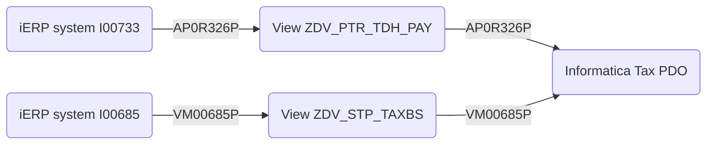
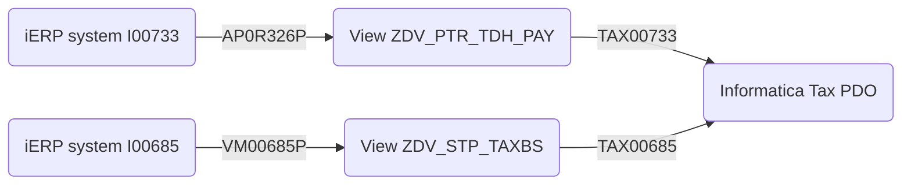
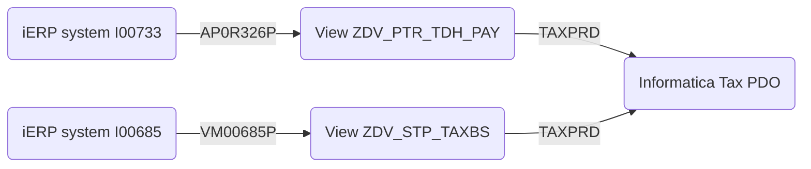

#### Share same credential

```mermaid
flowchart LR
    I00733(iERP system I00733)--AP0R326P -->ViewI00733( View ZDV_PTR_TDH_PAY)
    ViewI00733--AP0R326P-->IICS(Informatica Tax PDO)
    I00685(iERP system I00685)--VM00685P -->ViewI00685(View ZDV_STP_TAXBS)
    ViewI00685--VM00685P -->IICS

```    

#### Use several credentials for Tax PDO

```mermaid
flowchart LR
    I00733(iERP system I00733)--AP0R326P -->ViewI00733( View ZDV_PTR_TDH_PAY)
    ViewI00733-- TAX00733 -->IICS(Informatica Tax PDO)
    I00685(iERP system I00685)--VM00685P -->ViewI00685(View ZDV_STP_TAXBS)
    ViewI00685-- TAX00685 -->IICS

```    

#### Use one own credential

```mermaid
flowchart LR
    I00733(iERP system I00733)--AP0R326P -->ViewI00733( View ZDV_PTR_TDH_PAY)
    ViewI00733-- TAXPRD -->IICS(Informatica Tax PDO)
    I00685(iERP system I00685)--VM00685P -->ViewI00685(View ZDV_STP_TAXBS)
    ViewI00685-- TAXPRD -->IICS

```    
