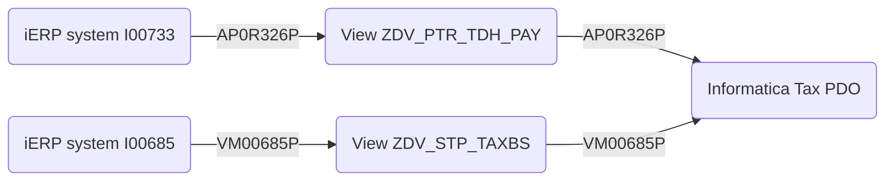
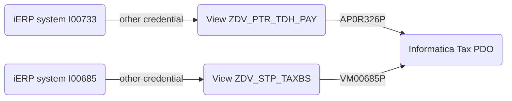
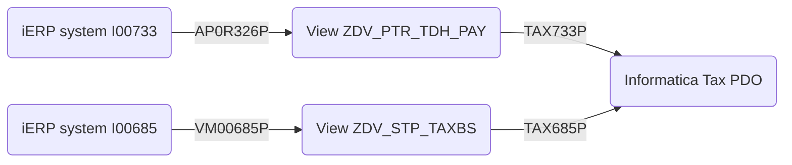
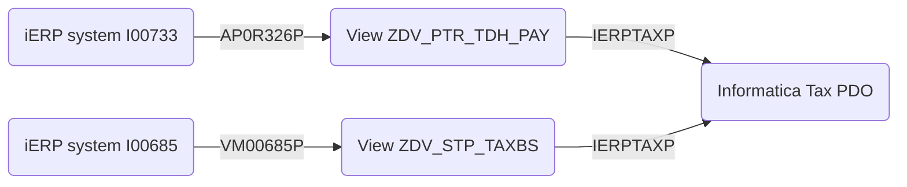

## Current situation

Today the credentials `AP0R326P` and `VM00685P` are owned by iERP teams, but used by the PDO Tax team to read the data
| Interface              | Account     | Reports to | Sponsor  | CDV View |
| ---------------------- | -------     | ---------- | -------- | --------- 
| I00733 Payable Details | AP0R326P    | RKARTH39   | HLOGANAT | ZDV_PTR_TDH_PAY |
| I00685 Vendor Master   | VM00685P    | DPINNAMA   | JBAJI    | ZDV_STP_TAXBS

I don't know whether the accounts are used to provide data for the views or if there are used only by TAX PDO team.

#### Same credential for write and read 

#### Own credentials for PDO TAX team, but owned by IERP teams

## Future situation

PDO Tax Team has own credentials for reading the view

### Write access
| Interface              | Account     | Reports to | Sponsor  | CDV View |
| ---------------------- | -------     | ---------- | -------- | --------- 
| I00733 Payable Details | AP0R326P    | RKARTH39   | HLOGANAT | ZDV_PTR_TDH_PAY |
| I00685 Vendor Master   | VM00685P    | DPINNAMA   | JBAJI    | ZDV_STP_TAXBS

### Read access solution 1
| Interface              | Account    | Reports to | Sponsor  | CDV View |
| ---------------------- | -------    | ---------- | -------- | --------- 
| I00733 Payable Details | TAX733P    | GWAGNER9   | GWAGNER9 | ZDV_PTR_TDH_PAY |
| I00685 Vendor Master   | TAX685P    | GWAGNER9   | GWAGNER9 | ZDV_STP_TAXBS

### Read access solution 2
| Interface              | Account    | Reports to | Sponsor  | CDV View |
| ---------------------- | -------    | ---------- | -------- | --------- 
| I00733 Payable Details | IERPTAXP    | GWAGNER9   | GWAGNER9 | ZDV_PTR_TDH_PAY |
| I00685 Vendor Master   | IERPTAXP    | GWAGNER9   | GWAGNER9 | ZDV_STP_TAXBS

